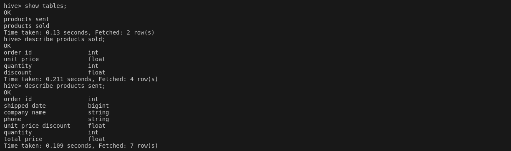
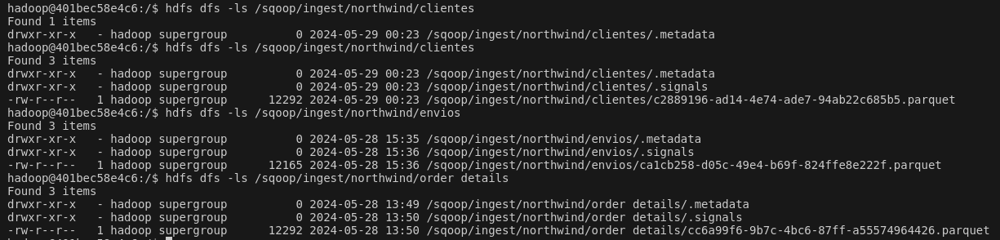
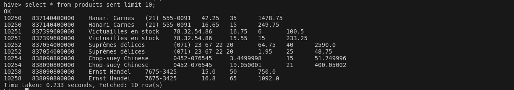
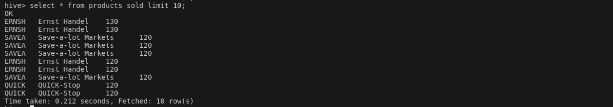
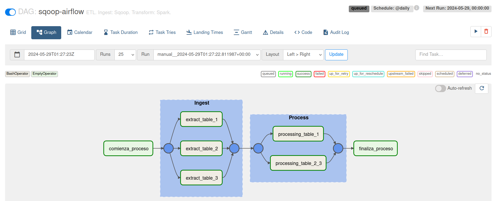
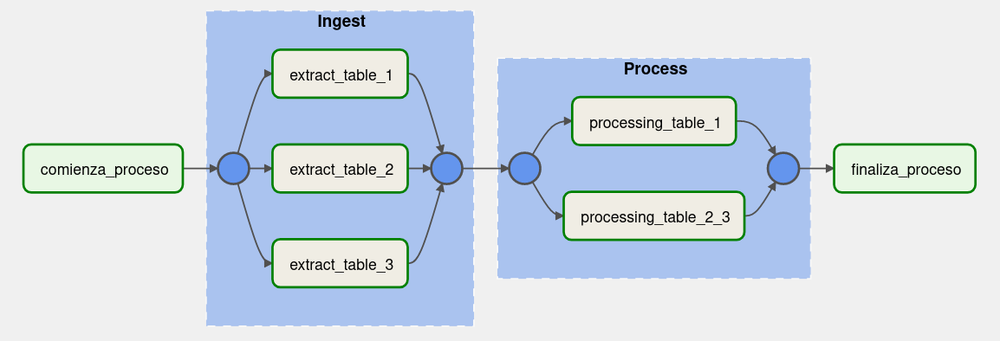

# Airflow con Hive y Sqoop

## Ejercicio de la Clase 9 del Bootcamp de Data Enginering

Por cada ejercicio, escribir el código y agregar una captura de pantalla del resultado obtenido.

### 1. Crear una base de datos y tablas en Hive. 

Base de datos: northwind_analytics. 
Tablas: products_sent, products_sold.

Para la creación de la database se utiliza la sentencia de Hive:

```bash 
CREATE DATABASE northwind_analytics;
``` 


En cuanto a las tablas, se crearán mediante Spark en el punto 3.



### 2. Crear scripts para importar distintos archivos .parquet de la base northwind en Postgress con Sqoop e ingestarlos a HDFS.

a.  El primero debe obtener la lista de clientes junto a la cantidad de productos vendidos ordenados de mayor a menor (campos customer_id, company_name, productos_vendidos). Luego ingestar el archivo a HDFS (carpeta /sqoop/ingest/clientes). Pasar la password en un archivo

Script en [extract_table_1.sh](src/ingest/extract_table_1.sh).

b. El siguiente debe obtener la lista de órdenes junto a qué empresa realizó cada pedido (campos order_id,
shipped_date, company_name, phone). Luego ingestar el archivo a HDFS (carpeta
/sqoop/ingest/envíos). Pasar la password en un archivo

Script en [extract_table_2.sh](src/ingest/extract_table_2.sh).

c, El último debe obtener la lista de detalles de órdenes (campos order_id, unit_price, quantity, discount). Luego
ingestar el archivo a HDFS (carpeta /sqoop/ingest/order_details). Pasar la password en
un archivo

Script en [extract_table_3.sh](src/ingest/extract_table_3.sh).



### 3. Generar archivos .py que permitan mediante Spark insertar en Hive en la db northwind_analytics:

a. En la tabla products_sold: los datos del punto 2, pero solamente aquellas compañías en las que la cantidad de  productos vendidos fue mayor al promedio.

Script en [proccesing_table_1.py](src/transform/processing_table_1.py).




b. En la tabla products_sent: los datos del punto 3 y 4, de manera tal que se vean las columnas order_id, shipped_date, company_name, phone, unit_price_discount (unit_price with
discount), quantity, total_price (unit_price_discount * quantity). Solo de aquellos pedidos
que hayan tenido descuento.

Script en [proccesing_table_2_3.py](src/transform/processing_table_2_3.py).




### 4. Realizar un proceso automático en Airflow

Debe que orquestar los pipelines creados en los
puntos anteriores. Crear un grupo para la etapa de ingest y otro para la etapa de
process. Correrlo y mostrar una captura de pantalla (del DAG y del resultado en la base
de datos)

Script en [sqoop-airflow.py](src/dag/sqoop-airflow.py).

Dag en el webserver de Airflow. 





